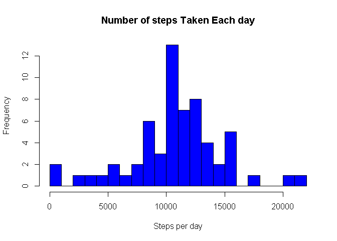

# Reproducible Research: Peer Assessment 1


## Loading and preprocessing the data


```r
activity <- read.csv("C:/Users/Srinivas/Documents/activity.csv")
```

## What is mean total number of steps taken per day?

```r
steps_per_day <- aggregate(steps~date,activity,sum,na.rm=TRUE)
steps_mean <- mean(steps_per_day$steps)
steps_median <- median(steps_per_day$steps)
```
Mean of the total number of steps taken per day = 10766

Median of the total number of steps taken per day = 10765

### A histogram of the total number of steps taken each day


```r
hist(steps_per_day$steps, xlab="Steps per day", breaks=20,main = "Number of steps Taken Each day",col="magenta")
```

 


## What is the average daily activity pattern?


```r
ave_steps_per_interval <- aggregate(steps~interval,activity,mean, na.rm=TRUE)
plot(steps~interval,ave_steps_per_interval,type="l", xlab="Interval", ylab="Average Number of Steps", main="Average Steps per Interval",col="blue")
```

 

Which 5-minute interval, on average across all the days in the dataset, contains the maximum number of steps?


```r
ave_steps_per_interval[which.max(ave_steps_per_interval$steps),1]
```

```
## [1] 835
```

## Imputing missing values
Imputing missing values is done using the random.imp function available in the "mi" library. The random.imp function randomly imputes the missing values using the distribution of the variables in which the missing values are found.

Calculate and report the total number of missing values in the dataset (i.e. the total number of rows with NAs)


```r
Total_missing_values <- sum(is.na(activity))
```

Number of missing values in the dataset are 2304


```r
library(mi)
```

```
## Warning: package 'mi' was built under R version 3.1.3
```

```
## Loading required package: arm
```

```
## Warning: package 'arm' was built under R version 3.1.3
```

```
## Loading required package: MASS
## Loading required package: Matrix
## Loading required package: lme4
```

```
## Warning: package 'lme4' was built under R version 3.1.3
```

```
## Loading required package: Rcpp
## 
## arm (Version 1.8-4, built: 2015-04-07)
## 
## Working directory is C:/Users/Srinivas/RepData_PeerAssessment1
## 
## Loading required package: mi
```

```
## Warning: package 'mi' was built under R version 3.1.3
```

```
## 
## mi (Version 0.10-2, built: 2015-04-07)
```


```r
activity.imputed <- random.imp(activity)
```

New dataset has been created after imputing the missing values.


```r
steps_per_day.imputed <- aggregate(steps~date,activity.imputed,sum)
```


```r
steps_imputed_mean <- mean(steps_per_day.imputed$steps)
steps_imputed_median <- median(steps_per_day.imputed$steps)
```
####The mean and median after imputing the missing values

mean(imputed) = 10809

median(imputed) = 10804

#### histogram of the total number of steps taken each day with the imputed data


```r
hist(steps_per_day.imputed$steps, breaks=20, xlab="Steps per day", main = "Number of steps Taken Each day",col="blue")
```

 

With imputed data the values are slightly changed.

## Are there differences in activity patterns between weekdays and weekends?

Create a new factor variable in the dataset with two levels - "weekday" and "weekend" indicating whether a given date is a weekday or weekend day.


```r
activity.imputed$day <- ifelse(is.element(weekdays(as.Date(activity.imputed$date,"%m/%d/%Y")),c("Saturday", "Sunday")),"weekend","weekday")
activity.imputed$day <- as.factor(activity.imputed$day)
str(activity.imputed)
```

```
## 'data.frame':	17568 obs. of  4 variables:
##  $ steps   : int  0 0 0 0 0 0 0 0 0 0 ...
##  $ date    : Factor w/ 61 levels "10/1/2012","10/10/2012",..: 1 1 1 1 1 1 1 1 1 1 ...
##  $ interval: int  0 5 10 15 20 25 30 35 40 45 ...
##  $ day     : Factor w/ 2 levels "weekday","weekend": 1 1 1 1 1 1 1 1 1 1 ...
```

#### A panel plot containing a time series plot (i.e. type = "l") of the 5-minute interval (x-axis) and the average number of steps taken, averaged across all weekday days or weekend days (y-axis).


```r
ave_steps_per_interval_day <- aggregate(steps~interval+day,activity.imputed,mean)
library(lattice)
xyplot(steps~interval|day,ave_steps_per_interval_day, type="l", layout=c(1,2))
```

 
